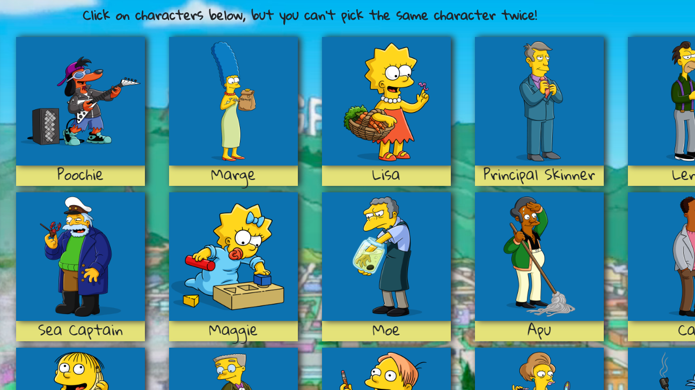

### Simpsons Clicky Game

PLay the Simpsons Clicky Game, A ReactJs Web App memory game where you try to click on the 24 Simpsons characters shown, but without clicking on the same one twice. 

Every character you clicked on that you haven't clicked on before will increase your score by one (plus the screen will flash green). If you click on each of the 24 characters once, you win (The screen will flash multiple colors, too). However, If you click on a character twice during one game, then you lose, the screen flashes red, and your score and the game is reset. Your high-score, however, will be saved so you can keep track of your best game

If you win (Reach a score of 24 for the current game), you can play a new game but keep you currrent score, so you can potentially get well over 24 as a high score!

[Click here to play!](https://j0hnruss0.github.io/ClickyGame/)